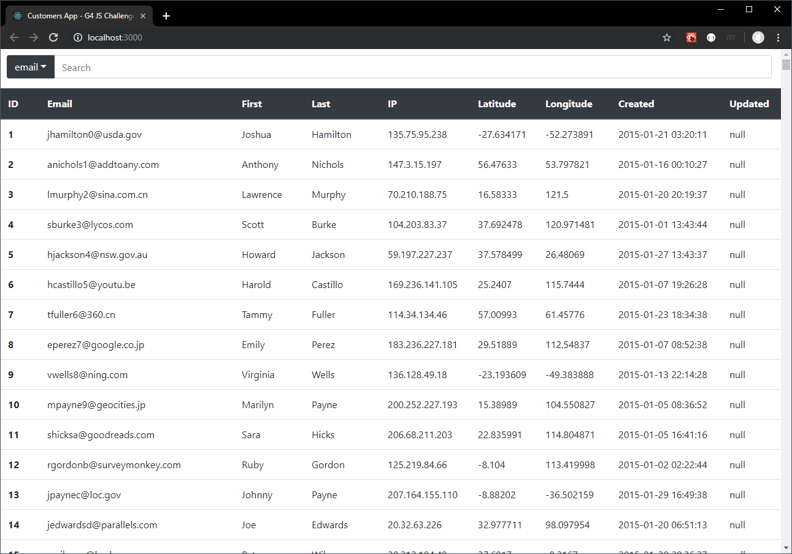

This project was bootstrapped with [Create React App](https://github.com/facebook/create-react-app).

## Summary
This is my solution to the JS Engineering Challenge.

This app was build using [React](https://reactjs.org/) and [Bootstrap](https://getbootstrap.com).
The app allows the user to search through the table by id, email, first/last name, etc. and the 
results are automatically updated as the user types. I hope you like it!

## Screenshot 

## Available Scripts

In the project directory, you can run:

### `npm start`

Runs the app in the development mode. 
Open [http://localhost:3000](http://localhost:3000) to view it in the browser.

The page will reload if you make edits. 
You will also see any lint errors in the console.

